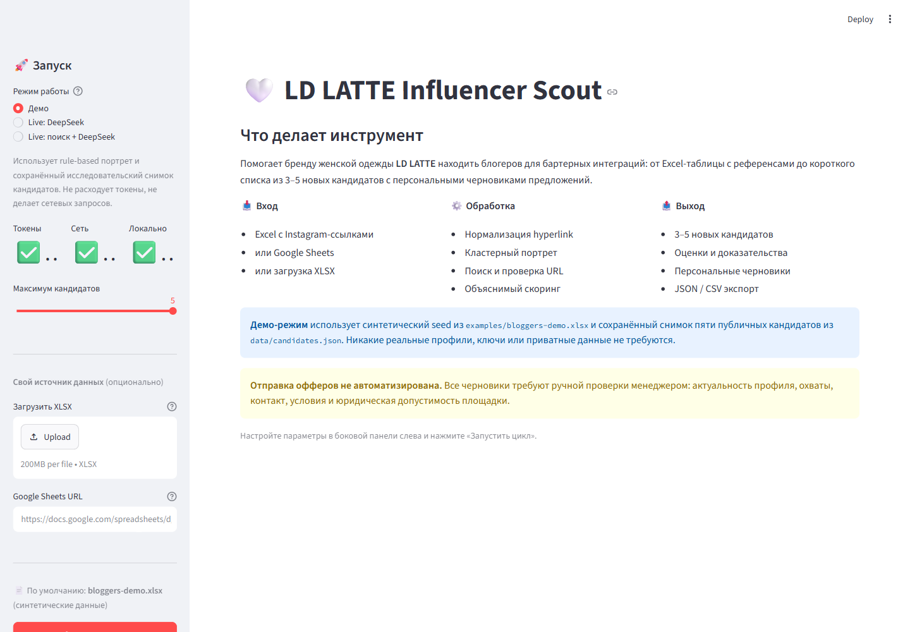
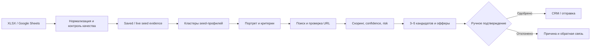

# LD LATTE AI Case Study

[](https://github.com/iurii-izman/ldlatte-ai-case-study/actions/workflows/ci.yml)
[](https://github.com/iurii-izman/ldlatte-ai-case-study/actions/workflows/codeql.yml)
[](https://www.python.org/)
[](LICENSE)

Тестовое задание для позиции AI-интегратора в fashion e-commerce. Главный результат —
рабочий прототип, который читает таблицу с подходящими блогерами, строит их кластерный
портрет, ранжирует новых кандидатов и готовит персональные черновики предложений о бартере.
В репозитории также собраны предложение по автоматизации рекламной аналитики и три прошлых
проекта.

**Начать отсюда:** [финальная версия тестового задания](SUBMISSION.md).

Технический навигатор: [все материалы и дополнительные документы](docs/index.md).



## Что можно проверить за пять минут

```powershell
py -3.12 -m venv .venv
.\.venv\Scripts\Activate.ps1
python -m pip install -r requirements.txt
streamlit run app.py
```

В интерфейсе достаточно нажать «Запустить цикл». По умолчанию используется
`examples/bloggers-demo.xlsx` — безопасная синтетическая таблица, поэтому для первого
запуска не нужны ни ключ API, ни закрытые материалы компании.

CLI-вариант:

```powershell
python -m ldlatte_agent.cli --input examples/bloggers-demo.xlsx `
  --output results/demo.json
```

## Что делает прототип

1. Читает XLSX или Google Sheets и нормализует Instagram-ссылки. Для Excel приоритет имеет
   настоящий `hyperlink.target`, а не только видимый текст ячейки.
2. В полном live-режиме собирает датированные публичные evidence по исходным профилям;
   отсутствие данных оставляет неизвестным.
3. Делит исходные аккаунты на core creators, визуальные референсы, смежные кластеры и
   выбросы. Благодаря этому бренд или крупный нерелевантный аккаунт не искажает портрет.
4. Строит портрет по эстетике, типу контента и операционной пригодности для бартера.
5. Использует построенный портрет для поисковых запросов и отбора, проверяет
   дубли и ранжирует кандидатов по объяснимой формуле; в demo доступен
   сохранённый исследовательский снимок.
6. Генерирует персональный черновик оффера на основе наблюдаемого факта.
7. Останавливается перед отправкой: решение и контакт всегда подтверждает человек.



Подробная схема и границы модулей описаны в
[архитектуре](docs/architecture.md), а полный разбор решений — в
[техническом досье](docs/part1-system-dossier.md).

## Данные и воспроизводимость

Прототип был отдельно проверен на выданной работодателем таблице: 34 уникальные ссылки,
включая шесть расхождений между видимым текстом и настоящим Excel hyperlink. Сам исходный
файл и производные seed-аннотации в GitHub не публикуются.

Публичный clone использует:

- синтетические seed-профили из `examples/`;
- утверждённый снимок пяти найденных публичных кандидатов из `data/candidates.json`;
- версионируемые промпты и детерминированный demo-режим.

Для приватного повторного прогона исходный XLSX и аннотации передаются явно:

```powershell
python -m ldlatte_agent.cli --input "docs\Блогеры.xlsx" `
  --annotations "data\private\seed_annotations.json" `
  --output "results\private.json"
```

Правило репозитория простое: `.env`, файлы работодателя, необработанные контакты и
производные приватные данные никогда не синхронизируются. Полная граница зафиксирована в
[ADR](docs/decisions/0001-public-data-boundary.md) и [AGENTS.md](AGENTS.md).

## Live-режим

Сейчас LLM-слой использует DeepSeek через совместимый Chat Completions API. Создайте
локальный `.env` по образцу:

```powershell
Copy-Item .env.example .env
```

После этого заполните `DEEPSEEK_API_KEY` и выберите live-режим в интерфейсе. Ключ не должен
попадать в логи, экспорт или Git. Провайдер изолирован интерфейсом `JSONLLMClient`, поэтому
переход на OpenAI не требует менять ingestion, discovery, scoring, UI или тесты.

Режим `Live: поиск + DeepSeek` выполняет полный исследовательский цикл: сначала
собирает индексируемые публичные evidence по каждому seed-профилю, затем строит
LLM-портрет, ищет новых кандидатов и готовит офферы. Через CLI ему соответствует:

```powershell
python -m ldlatte_agent.cli --input "docs\Блогеры.xlsx" `
  --annotations "data\private\seed_annotations.json" `
  --live-llm --live-seed-enrichment --live-discovery `
  --output "results\private-live.json"
```

## Проверки

```powershell
python -m pip install -r requirements.txt -r requirements-dev.txt
python -m ruff check .
python -m unittest discover -s tests -v
python scripts/evaluate_demo.py
```

GitHub Actions повторяет lint, тесты, demo-smoke и evaluation на Python 3.11 и 3.12.
CodeQL проверяет Python-код при каждом изменении и по расписанию, а Dependabot следит
за Python-зависимостями и GitHub Actions.

Подробнее о системе оценки: [evaluation.md](docs/evaluation.md).

## Ограничения

- Без разрешённого API Instagram нельзя обещать точную статистику обычных аккаунтов.
  Поэтому публичные метрики хранятся вместе с источником, датой и уверенностью.
- Расходящиеся метрики не склеиваются молча; пропуск не считается нулём.
- Найденный профиль не означает согласие на бартер. Условия и актуальные охваты нужно
  подтвердить перед контактом.
- Перед production-запуском нужны юридические правила маркировки рекламы, обработки данных
  и текста коммуникации.

Репозиторий опубликован для просмотра и не передаёт право на production- или коммерческое
использование. Условия — в [LICENSE](LICENSE).
