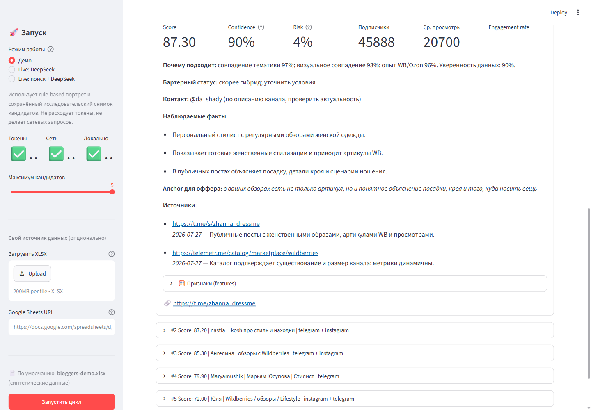
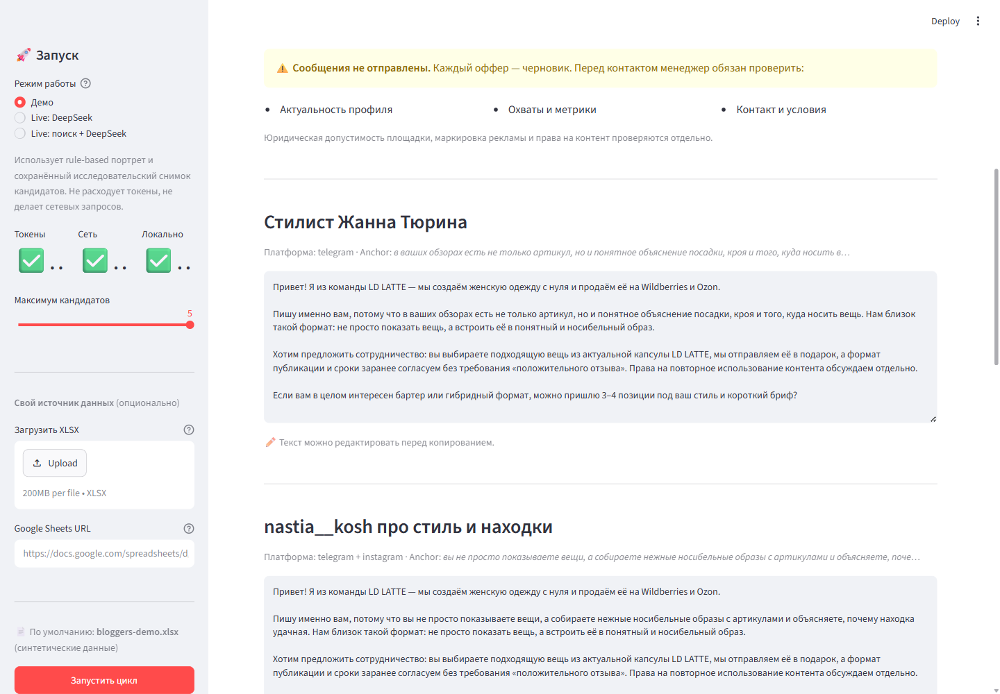

хочу присоединиться к команде

# Тестовое задание для LD LATTE

Здесь собран результат тестового задания на позицию AI-интегратора: рабочий
прототип поиска блогеров для бартера, предложение по автоматизации рекламной
аналитики и три моих прошлых проекта. Я постарался показать не только результат,
но и ход рассуждений: где ИИ действительно полезен, какие решения лучше оставить
детерминированному коду и где требуется контроль человека.

## Что посмотреть в первую очередь

1. [Результат части 1: портрет, пять кандидатов и офферы](docs/part1-results.md).
2. [Предложение по автоматизации рекламы и маржинальности](docs/part2.md).
3. [Три прошлых проекта](docs/part3.md).
4. [Архитектура прототипа](docs/architecture.md).
5. [Фактическое время](docs/time-spent.md).


## Часть 1. Поиск блогеров для бартера

Я собрал Streamlit-прототип, который принимает XLSX, Google Sheets URL или
загруженный файл и проходит весь цикл до черновика сообщения:

1. извлекает Instagram-профили и использует настоящий `hyperlink.target`, если
   отображаемый текст Excel скрывает другой адрес;
2. в полном live-режиме собирает по исходным профилям датированные публичные
   evidence; отсутствие данных сохраняет как `unknown`;
3. отделяет core creators от визуальных референсов, смежных тематик и выбросов;
4. строит портрет по эстетике, подаче, контенту и операционной пригодности;
5. на основе портрета использует сохранённый исследовательский snapshot или
   формирует live-поиск и отбор;
6. исключает дубли с исходной базой и ранжирует кандидатов прозрачной формулой;
7. формирует персональный оффер на основе наблюдаемого факта;
8. останавливается перед отправкой и требует подтверждения менеджера.

На выданной таблице загрузчик обнаружил 34 уникальных профиля и шесть случаев,
когда видимый текст Excel расходился с настоящим hyperlink. Сам исходный файл и
производные seed-аннотации не опубликованы. Проверяемые evidence собраны по 21
профилю; оставшиеся 13 помечены как `unknown`, а не дополнены догадками.
Публичный demo использует синтетический XLSX, а найденные кандидаты сохранены как
датированный snapshot с источниками и уровнем уверенности.

Три завершённых full-live прогона 28 июля 2026 года обработали все 34
seed-профиля. Из-за изменчивости поискового индекса evidence coverage менялся от
24 до 33 профилей, а число датированных источников — от 46 до 73; пропуски
оставались `unknown`. Каждый прогон вернул три новых кандидата без пересечения с
исходной базой, с источниками, score и персональными офферами. Производные
live-результаты не публикуются, потому что связаны с исходной таблицей.



Офферы остаются редактируемыми черновиками. Интерфейс отдельно напоминает
проверить актуальность профиля, охваты, контакт, условия и юридическую
допустимость до любого обращения.



### Быстрый запуск

```powershell
py -3.12 -m venv .venv
.\.venv\Scripts\Activate.ps1
python -m pip install -r requirements.txt
streamlit run app.py
```

После запуска достаточно оставить режим «Демо» и нажать «Запустить цикл». Ключ
API для этого не нужен.

CLI:

```powershell
python -m ldlatte_agent.cli --input examples/bloggers-demo.xlsx `
  --output results/demo.json
```

Проверяемость решения:

- [промпты](prompts);
- [подробная архитектура](docs/architecture.md);
- [evaluation harness](docs/evaluation.md);
- [полное техническое досье](docs/part1-system-dossier.md);
- [CI](https://github.com/iurii-izman/ldlatte-ai-case-study/actions).

## Часть 2. Что я бы автоматизировал

Я выбрал ежедневный анализ рекламы по SKU на Wildberries и Ozon. Основная
проблема — ДРР и ROAS сами по себе не показывают прибыль после невыкупов,
возвратов, комиссии, логистики, себестоимости и дефицита размеров.

Обычный код должен рассчитывать деньги и точку безубыточности, а ИИ — объяснять
отклонения и предлагать следующее действие с опорой на конкретные цифры. Первый
месяц сервис ничего не меняет автоматически: две недели работает в фоне, затем
проверяется на сопоставимых тестовой и контрольной группах. Главная метрика —
прирост маржинальной прибыли после рекламы минимум на 5% без падения выручки и
роста дефицита.

[Полная версия части 2](docs/part2.md).

## Часть 3. Прошлые проекты

### AI Lead Intake for Bitrix24

Сервис принимает входящие лиды, маскирует чувствительные данные, классифицирует
обращение, применяет правила маршрутизации и синхронизирует результат с
Bitrix24. Я самостоятельно спроектировал процесс и AI/CRM-границы, реализовал
API, фоновую обработку, очередь ручной проверки, тесты и документацию.

[Репозиторий](https://github.com/iurii-izman/ai-lead-intake-bitrix24).

### Bitrix24 Communication Summary Agent

AI-агент превращает звонки, письма, чаты и заметки в структурированные
CRM-действия: резюме, договорённости, риски, следующие шаги и черновик ответа.
Я реализовал pipeline, схему AI-ответа, human-in-the-loop сценарий, интеграцию,
защиту от случайной записи и воспроизводимые runbooks.

[Репозиторий](https://github.com/iurii-izman/bitrix24-communication-summary-agent).

### Replyline

Windows-приложение, которое по горячей клавише захватывает короткий фрагмент
системного аудио и возвращает компактную карточку с рекомендуемым ответом или
следующим действием. Я сформулировал продуктовый сценарий, разработал
Tauri/Rust backend, SolidJS-интерфейс, подключил STT и LLM и подготовил
release-процесс.

[Демо](https://iurii-izman.github.io/replyline/) ·
[репозиторий](https://github.com/iurii-izman/replyline).

Подробнее о роли, стеке и проверяемых результатах:
[часть 3](docs/part3.md).

## Фактическое время

| Часть | Время |
|---|---:|
| Поиск блогеров | 6 ч |
| Автоматизация процесса | 1 ч |
| Прошлые работы | 3 ч |
| Общая упаковка | 2 ч |
| **Итого** | **12 ч** |

## Что сознательно осталось за границами MVP

- Нет обещания точных Instagram-метрик без разрешённого API.
- Публичные каталоги и поисковые результаты считаются evidence, а не официальной
  статистикой платформы.
- Неизвестные показатели не превращаются в нули.
- Инструмент не отправляет сообщения автоматически.
- Перед production-запуском нужны правила обработки данных, маркировки рекламы,
  юридические формулировки и интеграция с CRM.

Это тестовый прототип: его задача — показать рабочий подход, проверяемость и
безопасные границы автоматизации, а не имитировать готовый production-сервис.
