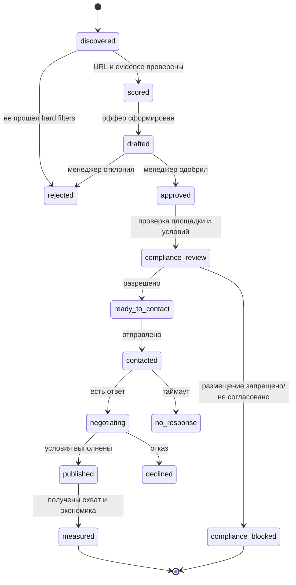

# Схема автоматизации

## Контуры и текущий статус

1. **Ingestion — реализовано.** Локальный XLSX, upload или публичная Google
   Sheets XLSX-export. Ссылки нормализуются, tracking-параметры удаляются,
   hyperlink Excel имеет приоритет над видимым текстом. Закрытая таблица через
   service account пока не реализована.
2. **Seed enrichment — MVP.** Полный live-режим автоматически собирает по каждому
   seed датированные evidence из публичного поискового индекса и передаёт их в
   LLM-портрет. Сохранённый snapshot покрывает 21 из 34 профилей; три
   контрольных live-run дали evidence по 24–33 профилям из 46–73 источников.
   Пропуски остаются `unknown`. Прямые platform adapters и мультимодальность —
   следующая итерация.
3. **Portrait — реализовано.** Seed сначала делится на роли. Visual references
   отвечают только за эстетику, core creators — за контент и аудиторию, outliers
   не сдвигают диапазоны.
4. **Discovery — MVP.** Запросы из построенного портрета дополняются безопасным
   базовым набором для recall, а сам portrait передаётся в LLM-отбор.
   Используются индексируемый web и Telegram. YouTube Data API и разрешённый
   Instagram business/creator adapter пока не реализованы.
5. **Validation — реализовано частично.** URL должен присутствовать в выдаче,
   отсутствовать в seed и пройти фильтры. LLM не может создать URL. Прямой
   profile-health check и freshness gate нужно добавить.
6. **Ranking — реализовано.** Детерминированная формула с весами, confidence и
   risk. LLM только извлекает признаки.
7. **Outreach — только черновик.** Оффер использует конкретное наблюдение.
   Встроенной отправки нет; это намеренное ограничение.
8. **Compliance — спроектировано.** Перед контактом нужен отдельный legal/channel
   gate, который не равен score кандидата.
9. **Learning loop — спроектировано.** Ответ, согласие, стоимость, публикация,
   охват, заказы и маржа должны возвращаться в систему, но текущий код этого ещё
   не делает.

## Целевые состояния кандидата

State machine ниже описывает production-workflow. В текущем MVP реализованы
поиск, score и draft; CRM-переходы пока существуют только как проект.



## Контракт данных

Минимальная запись evidence:

```json
{
  "profile_url": "точный публичный URL",
  "observed_at": "ISO-8601",
  "source_url": "где увидели факт",
  "fact": "короткая наблюдаемая формулировка",
  "confidence": 0.0
}
```

Так можно пересчитать score без повторного LLM-вызова и показать менеджеру, откуда взялся каждый вывод.

## Production-изменения

- Google service account с доступом только к нужной таблице.
- Разрешённые platform adapters для enrichment и freshness policy.
- YouTube/Telegram/разрешённый Instagram adapter.
- Очередь задач, retry с backoff, кэш и лимиты запросов.
- Хранилище секретов вместо `.env`.
- Отдельный журнал согласий и рекламной маркировки.
- Legal/channel policy gate до отправки.
- Ручной approval в Telegram-боте/CRM.
- Контрольная группа кандидатов и ежемесячная калибровка весов по contribution margin.

Полное описание: [part1-system-dossier.md](part1-system-dossier.md).
