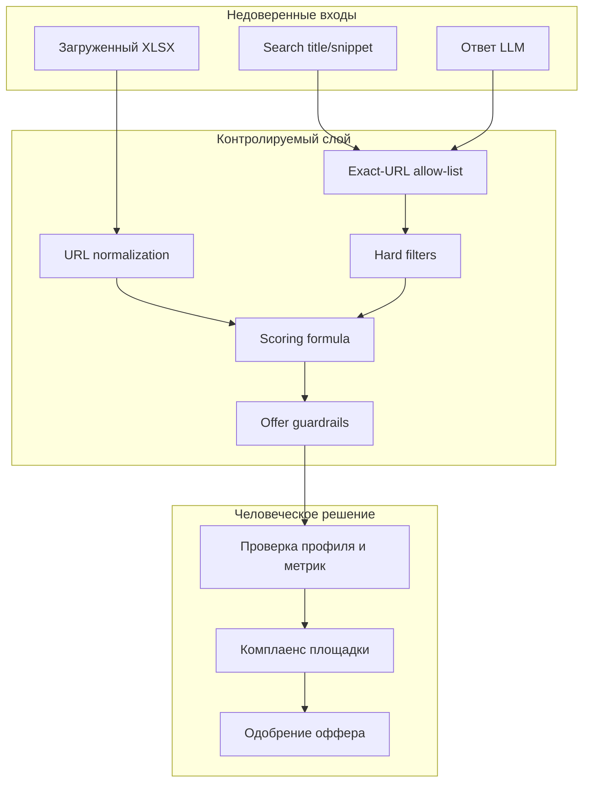
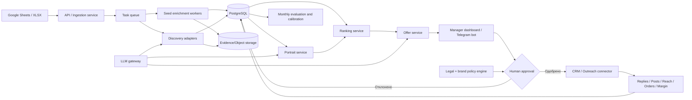

# LD LATTE Influencer Scout: полное досье системы

Актуальность описания: **27 июля 2026 года**.
Версия прототипа: **0.1.0**.
Назначение документа: технический и продуктовый контекст для человека или
другой AI-модели. Это расширенный внутренний материал, а не короткий ответ для
работодателя.

## 1. Коротко: что это за программа

`LD LATTE Influencer Scout` — рабочий прототип для поиска блогеров под бартерные
интеграции бренда женской одежды. Он закрывает путь от исходной Excel-базы до
короткого списка новых кандидатов и персональных черновиков сообщений:

1. читает локальный XLSX, загруженный пользователем файл или публичную Google
   Sheets;
2. извлекает реальные ссылки из ячеек, включая скрытые Excel-hyperlink’и;
3. нормализует Instagram-адреса и удаляет tracking-параметры;
4. разделяет исходные профили по ролям, чтобы бренды и тематические выбросы не
   искажали портрет блогера;
5. строит эстетический и операционный портрет подходящего автора;
6. использует сохранённый проверяемый снимок кандидатов либо выполняет live
   web-поиск;
7. отбрасывает профили без разрешённого URL, seed-дубли и очевидные агрегаторы;
8. ранжирует кандидатов прозрачной формулой;
9. создаёт персональный черновик оффера;
10. показывает доказательства и выгружает полный результат в JSON.

Программа не является автоспамером. Она ничего не публикует и никому не пишет
без человека. Финальное решение и отправка сообщения остаются за менеджером.

## 2. Какую бизнес-задачу решает

Поиск блогеров вручную состоит не только из просмотра красивых профилей.
Менеджеру нужно:

- понять, какие признаки объединяют успешные референсы;
- не смешать эстетику, тематику и коммерческую пригодность;
- найти авторов вне уже известной базы;
- проверить, что профиль живой, личный и релевантный;
- сопоставить аудиторию, охваты, свежесть, риски и вероятность бартера;
- сохранить источник каждого вывода;
- написать не массовое, а персональное сообщение;
- не потерять историю решений и результатов сотрудничества.

Прототип стандартизирует этот процесс. Его ценность не в том, что LLM умеет
написать «красивое сообщение», а в том, что до сообщения есть очистка данных,
классификация seed-базы, проверка URL, объяснимый score и явная неопределённость.

### Рабочая бизнес-гипотеза

Если автоматизировать сбор, первичный отбор и подготовку черновика, менеджер
сможет тратить время не на десятки нерелевантных профилей, а на проверку
короткого списка. Пользу следует измерять не количеством найденных аккаунтов,
а качеством воронки:

`кандидат → одобрен менеджером → контакт → ответ → договорённость → публикация → измеренный результат`.

## 3. Для кого предназначена система

| Роль | Что получает |
|---|---|
| Influencer-менеджер | Короткий список, причины score, источники и черновики сообщений |
| Руководитель маркетинга | Портрет автора, правила отбора, риски и состояние воронки |
| AI-специалист | Разделённые deterministic/LLM-компоненты, промпты и точки улучшения |
| Аналитик | Структурированный JSON для отчёта и последующей оценки результата |
| Юрист/комплаенс | Площадку, формат сотрудничества, права на контент и обязательные ручные проверки |

## 4. Что реализовано сейчас, а что пока является целевой архитектурой

| Возможность | Статус | Комментарий |
|---|---|---|
| Чтение реального `Блогеры.xlsx` | Работает | Проверено на исходном файле |
| Upload другого XLSX | Работает | Через Streamlit |
| Публичная Google Sheets по ссылке | Работает | Через XLSX-export |
| Закрытая Google Sheets через service account | Не реализовано | Описано как production-шаг |
| Нормализация Instagram URL | Работает | Удаляются query-параметры, post/reel URL не принимаются |
| Извлечение скрытых hyperlink | Работает | В реальной таблице исправляется 6 адресов |
| Автоматическое enrichment всех seed | Не реализовано | 21 профиль размечен сохранёнными доказательствами, 13 остаются unknown |
| Кластерный rule-based portrait | Работает | Не требует LLM |
| LLM portrait | Работает | Использует DeepSeek и сохранённые evidence |
| Cached top-5 | Работает | Воспроизводимый снимок с источниками |
| Live web discovery | Работает как MVP | DDGS + LLM, качество зависит от поискового индекса |
| Instagram discovery | Частично | Только индексируемые публичные результаты |
| Telegram discovery | Работает как MVP | Индексируемые публичные страницы |
| YouTube Shorts adapter | Не реализован | Prompt допускает YouTube, код URL пока не обрабатывает |
| Мультимодальный анализ визуала | Не реализован | Aesthetic fit сейчас основан на сохранённых evidence и сниппетах |
| Объяснимый deterministic scoring | Работает | LLM не вычисляет итоговый балл |
| Персональные deterministic-офферы | Работает | Без токенов |
| Персональные LLM-офферы | Работает | Есть fallback против выдуманного отправителя |
| Ручное подтверждение | Есть как правило UX | Встроенной кнопки отправки нет |
| Автоматическая отправка сообщений | Намеренно отсутствует | Нужны approval, комплаенс и платформенные интеграции |
| CRM-воронка и learning loop | Спроектированы | Не реализованы в текущем коде |
| База данных и аудит | Не реализованы | Результат пока экспортируется в JSON |

## 5. Реальные входные данные

Источник: `docs/Блогеры.xlsx`. Файл не предназначен для публикации в открытом
репозитории.

### Лист `Исходник`

| Характеристика | Значение |
|---|---:|
| Используемый диапазон | `A1:B74` |
| Колонки | Номер, ссылка/отображаемый текст |
| Уникальных нормализованных Instagram-профилей | 34 |
| Исправлено скрытых hyperlink-адресов | 6 |
| Аннотировано evidence | 21 |
| Остаются без достаточных evidence | 13 |

В нумерации есть пропуски, а между записями встречаются пустые строки. Это
нормальная особенность исходной таблицы, а не ошибка загрузчика.

Критически важная деталь: видимый текст ячейки и `cell.hyperlink.target` иногда
не совпадают. Например, визуально может быть показано старое имя либо текст
Instagram-страницы, а настоящий URL хранится в hyperlink. Загрузчик намеренно
ставит hyperlink выше отображаемого значения.

### Лист `Новые блоггеры`

| Характеристика | Значение |
|---|---:|
| Используемый диапазон | `A1:D4` |
| Колонки | Ссылка, оценка, причина, оффер |
| Legacy-кандидатов | 3 |

Три записи имеют оценки 5, 5 и 4, но тематически слабо связаны с женской одеждой
LD LATTE. Текущий pipeline не принимает их за эталон и не использует как готовый
результат.

### Разделение seed по ролям

| Роль | Количество | Влияние |
|---|---:|---|
| `core_creator` | 8 | Тематика, подача, признаки аудитории |
| `visual_reference` | 2 | Только визуальный архетип |
| `secondary_cluster` | 6 | Соседние темы, но не ядро |
| `outlier` | 5 | Не должен сдвигать портрет |
| `unknown` | 13 | Неизвестно до получения evidence |

Nike и Apple — `visual_reference`, а не потенциальные партнёры. Они не должны
влиять на диапазон подписчиков, вовлечённость или вероятность бартера.

Текущее evidence coverage rule-based портрета равно **0,62**: доказательства
есть по 21 из 34 профилей. Это честное ограничение текущего MVP и главный объект
следующей итерации.

## 6. Три режима запуска

| Режим | Портрет | Кандидаты | Офферы | Внешние вызовы |
|---|---|---|---|---|
| `Демо` | Rule-based | Cached snapshot | Deterministic | Нет |
| `Live: DeepSeek` | DeepSeek | Cached snapshot | DeepSeek | 1 + N LLM-вызовов |
| `Live: поиск + DeepSeek` | DeepSeek | DDGS + DeepSeek, затем fallback | DeepSeek | Web search + 2 + N LLM-вызовов |

При `N = 5`:

- live без поиска делает до 6 LLM-вызовов: один портрет и пять офферов;
- live с поиском делает до 7 LLM-вызовов: портрет, discovery и пять офферов;
- верхние лимиты ответа составляют 2 200 токенов для портрета, 2 400 для
  discovery и по 900 для оффера;
- фактический расход зависит от объёма evidence и длины ответов.

Демо-режим нужен не только ради экономии. Он обеспечивает воспроизводимую
демонстрацию, которая не зависит от сети, состояния поискового индекса и ответа
LLM в конкретную минуту.

## 7. Архитектура текущего MVP

```mermaid
flowchart LR
    A["Локальный XLSX"] --> D["Источник"]
    B["Upload XLSX"] --> D
    C["Публичная Google Sheets"] --> D
    D --> E["XLSX loader"]
    E --> F["Нормализация URL и data-quality report"]
    F --> G["Seed + annotations"]
    G --> H{"Режим портрета"}
    H -->|Demo| I["Rule-based portrait"]
    H -->|Live| J["DeepSeek portrait"]
    I --> K{"Режим discovery"}
    J --> K
    K -->|Demo| L["Cached candidate snapshot"]
    K -->|Live| M["DDGS search results"]
    M --> N["Exact-URL allow-list + LLM extraction"]
    N --> O["Hard filters"]
    L --> P["Deterministic scoring"]
    O --> P
    P --> Q{"Оффер"}
    Q -->|Demo| R["Deterministic template"]
    Q -->|Live| S["DeepSeek + safety fallback"]
    R --> T["PipelineResult"]
    S --> T
    T --> U["Streamlit UI"]
    T --> V["CLI JSON"]
    U --> W["Ручная проверка"]
    V --> W
```



### Главная архитектурная идея

LLM используется там, где полезна интерпретация неструктурированного текста:
кластеризация evidence, извлечение признаков из поисковых сниппетов и написание
оффера. Критические ограничения остаются в обычном коде:

- URL должен быть получен из реальной поисковой выдачи;
- seed-дубли запрещены;
- feature-значения ограничиваются диапазоном;
- итоговый score рассчитывается формулой;
- отсутствие метрики не превращается в ноль;
- готовность к бартеру не считается доказанным фактом;
- отправка требует человека.

## 8. Границы доверия



Модель не является источником истины. Она работает между evidence и
детерминированными ограничениями.

## 9. Карта файлов и компонентов

| Файл | Ответственность |
|---|---|
| `app.py` | Streamlit-интерфейс, выбор режима, вкладки, JSON-export |
| `ldlatte_agent/pipeline.py` | Оркестрация полного цикла |
| `ldlatte_agent/xlsx_loader.py` | Excel, hyperlink, Instagram normalization, data quality |
| `ldlatte_agent/google_sheets.py` | Преобразование публичной Sheets-ссылки в XLSX-export |
| `ldlatte_agent/portrait.py` | Rule-based и LLM-портрет |
| `ldlatte_agent/discovery.py` | Поисковые запросы, URL allow-list, фильтры и LLM-extraction |
| `ldlatte_agent/scoring.py` | Весовая модель и объяснение результата |
| `ldlatte_agent/offers.py` | Deterministic и LLM-офферы, safety fallback |
| `ldlatte_agent/llm.py` | JSON-интерфейс модели и DeepSeek adapter |
| `ldlatte_agent/models.py` | Контракты `SeedProfile`, `Candidate`, `PipelineResult` |
| `ldlatte_agent/cli.py` | Безынтерфейсный запуск и сохранение JSON |
| `data/seed_annotations.json` | Evidence-разметка 21 seed-профиля |
| `data/candidates.json` | Проверяемый снимок пяти кандидатов |
| `prompts/portrait.md` | Контракт кластерного портрета |
| `prompts/discovery.md` | Контракт отбора только из разрешённых URL |
| `prompts/offer.md` | Контракт персонального оффера |
| `tests/test_pipeline.py` | Девять unit/integration-lite проверок |

## 10. Поток данных по шагам

### Шаг 1. Выбор источника

В UI действует приоритет:

1. загруженный XLSX;
2. введённая Google Sheets URL;
3. локальный `docs/Блогеры.xlsx`.

CLI принимает путь через `--input`.

### Шаг 2. Google Sheets

Для URL вида `/spreadsheets/d/<id>/...` извлекается ID и при наличии `gid`.
Программа строит URL `export?format=xlsx`, скачивает файл в память и проверяет,
что получен ZIP/XLSX, а не HTML-страница авторизации.

Закрытая таблица пока не поддерживается. Упоминание service account в интерфейсе
описывает следующий production-шаг, а не готовую функцию.

### Шаг 3. Чтение Excel

`openpyxl` открывает книгу с `read_only=False`, потому что нужен доступ к
hyperlink-объектам. Загрузчик проходит строки со второй до последней, берёт
номер из колонки A и профиль из колонки B.

### Шаг 4. Нормализация

Алгоритм:

- принимает `@handle` либо URL;
- разрешает только `instagram.com`, `www.instagram.com`, `m.instagram.com`;
- берёт первый сегмент path;
- приводит handle к lower case;
- удаляет `igsh`, `utm_source` и прочие query-параметры;
- отклоняет `/p/`, `/reel/`, `/stories/`, `/explore/`;
- проверяет handle по `[a-z0-9._]{1,30}`;
- возвращает `https://www.instagram.com/<handle>/`;
- удаляет повторяющиеся handle.

### Шаг 5. Seed-аннотации

Сохранённые аннотации содержат:

- `handle`;
- роль профиля;
- тематические теги;
- наблюдаемые факты;
- source URL.

Разметка не подменяет автоматический enrichment. Это воспроизводимый evidence
snapshot, необходимый, пока Instagram не предоставляет разрешённый публичный API
для нужных данных.

### Шаг 6. Портрет

#### Rule-based

Считает распределение ролей и тегов, coverage и возвращает заранее
сформулированный архетип:

- чистая светлая или нейтральная картинка;
- женственная, носибельная стилизация;
- Pinterest-подобная композиция;
- примерки, детали посадки, готовые образы;
- тёплая подача «как рекомендация подруге»;
- конкретика: артикулы, параметры и сценарий ношения.

Операционные условия отделены от эстетики:

- русскоязычная женская аудитория;
- свежий контент;
- минимум два evidence;
- понятный путь к контакту;
- предпочтительный диапазон 5–80 тыс. подписчиков либо сопоставимый охват;
- опыт одежды/WB/Ozon;
- отсутствие непроверенных риск-сигналов.

#### LLM

DeepSeek получает не сырые ссылки, а evidence-пакет с role hints, тегами,
фактами и источниками. Prompt запрещает:

- усреднять все профили;
- считать бренд автором;
- превращать пропуск в ноль;
- выдумывать посты, географию и метрики;
- считать тематику доказательством согласия на бартер.

### Шаг 7. Discovery

MVP использует три фиксированных поисковых направления:

- Telegram: стилисты/обзоры + WB;
- Telegram: женственные образы + WB/Ozon;
- Instagram: находки/обзоры WB + стиль.

По умолчанию берётся до 8 результатов на запрос, то есть до 24 сырых результатов
до дедупликации.

LLM не выполняет поиск. Сначала DDGS возвращает URL, title и snippet. Затем
модель может выбрать только URL, посимвольно присутствующий в allow-list.

### Шаг 8. Фильтры кандидатов

Кандидат не проходит дальше, если:

- URL нельзя нормализовать;
- handle уже есть среди seed;
- модель вернула URL вне search result;
- указан не `personal_creator`;
- title/snippet похожи на агрегатор перепостов;
- профиль не прошёл структурные проверки.

Текущий код допускает отсутствие `profile_type` как совместимость с неполным
ответом LLM. Для production это следует ужесточить: принимать только явный
`personal_creator`.

### Шаг 9. Извлечение метрик

Если LLM не вернула followers, код пытается извлечь число из индексируемого
текста, понимая формы вроде:

- `136K Followers`;
- `57.4K subscribers`.

Если нет ни просмотров, ни ER, `engagement_quality` удаляется из feature map и
не штрафует кандидата.

Для неподтверждённого бартера действует ограничение:

- больше 80 тыс. подписчиков → `barter_likelihood ≤ 0.4`;
- 30–80 тыс. → `barter_likelihood ≤ 0.6`.

### Шаг 10. Scoring

Веса:

| Признак | Вес |
|---|---:|
| `content_fit` | 20% |
| `aesthetic_fit` | 20% |
| `marketplace_fit` | 15% |
| `engagement_quality` | 15% |
| `audience_fit` | 10% |
| `activity` | 10% |
| `barter_likelihood` | 10% |

Пусть `O` — множество наблюдаемых признаков, `xᵢ` — значение от 0 до 1, `wᵢ`
— вес, `c` — confidence, `r` — risk.

```text
raw = Σ(xᵢ × wᵢ) / Σ(wᵢ), i ∈ O
confidence_factor = 0.85 + 0.15 × c
risk_penalty = 0.15 × r
score = 100 × clamp(raw × confidence_factor − risk_penalty, 0, 1)
```

Ключевое решение: пропущенный признак не равен нулю. Формула перенормирует веса
только по наблюдаемым измерениям. Низкая полнота данных выражается через
`confidence`, а не через выдуманный плохой показатель.

Пример для Жанны:

- weighted raw ≈ 0,892;
- confidence 0,90 даёт factor 0,985;
- risk 0,04 даёт штраф 0,006;
- итог ≈ 87,3.

Пояснение score формируется без LLM: показываются три признака с максимальным
вкладом и confidence.

### Шаг 11. Оффер

Deterministic-версия использует `offer_anchor` и единый безопасный каркас:

- представиться как команда LD LATTE;
- объяснить конкретную причину обращения;
- предложить выбрать вещь из актуальной капсулы;
- согласовать формат и сроки;
- не требовать положительного отзыва;
- обсуждать права на повторное использование отдельно;
- спросить, можно ли прислать 3–4 позиции и бриф.

LLM-версия получает полный объект кандидата и должна вернуть JSON. Если текст
короче 80 символов или выдумывает имя/роль отправителя, применяется
deterministic fallback.

### Шаг 12. Результат

`PipelineResult` содержит:

- нормализованные seed;
- data-quality report;
- portrait;
- top candidates;
- run metadata.

UI отображает результат по вкладкам, CLI сохраняет его в JSON.

## 11. Контракты данных

### `SeedProfile`

| Поле | Значение |
|---|---|
| `excel_row` | Фактическая строка исходной книги |
| `number` | Номер из колонки A либо `null` |
| `display` | Видимый текст ячейки |
| `source_url` | Hyperlink target либо display |
| `handle` | Нормализованный идентификатор |
| `normalized_url` | Канонический Instagram URL |

### `Candidate`

| Группа | Поля |
|---|---|
| Идентичность | `handle`, `platform`, `url`, `title` |
| Метрики | `followers`, `avg_views`, `engagement_rate` |
| Evidence | `facts`, `sources` |
| Признаки | `features` |
| Неопределённость | `confidence`, `risk` |
| Коммерция | `cooperation_status`, `contact` |
| Персонализация | `offer_anchor` |
| Результат | `score`, `reason`, `offer` |

### Минимальный production-evidence

```json
{
  "profile_url": "точный публичный URL",
  "observed_at": "ISO-8601",
  "source_url": "страница, где виден факт",
  "fact": "наблюдаемая формулировка",
  "confidence": 0.0
}
```

В cached snapshot evidence уже хранится со временем и источником, но seed
annotations пока используют упрощённый формат без `observed_at` и отдельного
confidence на каждый факт.

## 12. Текущий результат top-5

Публичные метрики динамичны. Таблица ниже — снимок на 27 июля 2026 года, а не
вечная характеристика профиля.

| Score | Кандидат | Платформа | Followers | Avg views / ER | Статус |
|---:|---|---|---:|---|---|
| 87,3 | Жанна Тюрина | Telegram | 45 888 | 20 700 / нет данных | Скорее гибрид, уточнить |
| 87,2 | Настя | Telegram + Instagram | 57 394 | 8 912 / 15,53% | Скорее гибрид, уточнить |
| 85,3 | Ангелина | Telegram + Instagram | 48 370 | 6 400 / нет данных | Рекламный контакт открыт |
| 79,9 | Марьям | Telegram | 31 190 | 1 779 / 5,61% | Формат уточнить |
| 72,0 | Юля | Instagram + Telegram | 4 325 | нет данных / 1,87% | Запросить охваты |

У каждого кандидата есть три факта, один или два source URL, contact,
offer anchor, feature map, confidence и risk.

## 13. Интерфейс

### Sidebar

- режим запуска;
- limit 3–5;
- upload XLSX;
- Google Sheets URL;
- кнопка полного запуска.

### Вкладки

1. `Исходник` — количество seed, исправленные ссылки, data quality и таблица
   нормализованных профилей.
2. `Портрет` — JSON-портрет и предупреждение о кластеризации.
3. `Кандидаты` — score, метрики, причины, facts и sources.
4. `Офферы` — редактируемые текстовые черновики с предупреждением.
5. `Экспорт` — полный JSON.

### CLI

```powershell
python -m ldlatte_agent.cli `
  --input "docs\Блогеры.xlsx" `
  --output "results\run.json"
```

Флаги:

- `--live-llm`;
- `--live-discovery`;
- `--limit 3..5`.

## 14. Тестирование и доказательства работы

На текущем состоянии проходят **9 из 9** тестов.

| Проверка | Что доказывает |
|---|---|
| Tracking removal | Один профиль не распадается на разные URL |
| Post URL rejection | Пост не принимается за аккаунт |
| Aggregator detection | Очевидный канал перепостов отбрасывается |
| Followers parsing | K-метрики читаются из индексируемого текста |
| Google URL export | Sheets URL корректно превращается в XLSX |
| Real workbook hyperlink | Извлекаются 34 seed и 6+ скрытых адресов |
| Missing metric | Пропуск не считается нулём |
| Demo pipeline | Возвращаются 5 новых кандидатов с source и offer |
| Sender hallucination | Deterministic-оффер не выдумывает отправителя |

Также есть:

- рабочий Streamlit screenshot;
- контрольный CLI-прогон в `results/dossier-demo.json`;
- сохранённые evidence snapshots;
- полный отчёт в `docs/part1-results.md`.

### Чего тесты пока не покрывают

- реальные DeepSeek-вызовы;
- malformed/partial JSON от LLM;
- retry, timeout и rate limit;
- live DDGS instability;
- prompt injection из title/snippet;
- публичную и закрытую Google Sheets end-to-end;
- Streamlit UI;
- CLI error paths;
- проверку актуальности профиля;
- YouTube;
- CRM и отправку.

## 15. Что сделано хорошо с точки зрения надёжности

- `.env` и исходные XLSX/PDF исключены из Git;
- настоящий API-ключ не попадает в пример конфигурации;
- ошибки DeepSeek не печатают headers или ключ;
- URL из LLM сверяется с точной allow-list;
- score вычисляется обычным кодом;
- sources показываются менеджеру;
- пропуски не подменяются нулями;
- risk и confidence разделены;
- готовность к бартеру хранится отдельным статусом;
- оффер не требует положительного отзыва;
- LLM-оффер имеет fallback;
- автоматической отправки нет;
- demo не зависит от внешней сети.

## 16. Ключевые ограничения и технический долг

### P0 — влияет на достоверность или законность

1. **Нет автоматического seed enrichment.** Инструмент читает таблицу сам, но
   факты по seed сейчас подготовлены заранее только для 21 профиля.
2. **Нет мультимодального анализа визуала.** Aesthetic fit не извлекается из
   сетки изображений/роликов автоматически.
3. **Evidence кандидатов стареет.** Перед контактом нужны refresh и freshness
   gate.
4. **Нет юридического channel-policy gate.** Score не должен автоматически
   означать, что на площадке допустима рекламная публикация.
5. **Нет строгой JSON Schema/Pydantic-валидации ответа LLM.**
6. **Search snippet — недоверенный текст.** Нужна защита от prompt injection.
7. **Нет persistence и audit trail.** JSON-download недостаточен для команды.

### P1 — влияет на качество и эксплуатацию

1. YouTube заявлен в prompt, но URL adapter не реализован.
2. Instagram и Telegram adapter объединены с общим web search, а не с
   платформенными источниками.
3. Followers parser покрывает лишь часть форматов.
4. Aggregator heuristic очень узкий.
5. URL присутствует в поисковой выдаче, но прямой HTTP/profile-health check не
   выполняется.
6. `duplicate_handles` в data-quality report всегда равен нулю: счётчик
   фактических дублей не реализован.
7. `observed_at="live"` не является ISO-датой.
8. Нет кэша, retry/backoff и лимитов.
9. Офферы генерируются последовательно.
10. Нет prompt/model/version hashes в run manifest.
11. Нет authentication и cost controls для публичного Streamlit deployment.
12. Requirements заданы диапазонами, но нет lock-файла.

### P2 — продуктовые улучшения

- автоматический выбор наиболее подходящей вещи под стиль автора;
- история контактов и suppression list;
- дедупликация человека между платформами;
- прогноз ответа/бартерной готовности на фактических исходах;
- калибровка весов на contribution margin;
- learning-to-rank после накопления достаточной выборки;
- сравнение нескольких LLM по factuality, цене и качеству оффера.

## 17. Юридический и платформенный контур

Это не юридическое заключение. Перед production-запуском нужен ответственный
сотрудник или юрист.

Обязательные решения:

1. Является ли конкретная публикация рекламой.
2. Допустима ли реклама на выбранной площадке и для целевой географии.
3. Кто получает рекламный идентификатор и передаёт сведения.
4. Как выглядит маркировка.
5. Кто хранит договор, акт, подтверждение публикации и статистику.
6. Какие права бренд получает на фото/видео.
7. Можно ли использовать контент в карточках WB/Ozon, соцсетях и paid ads.
8. Сколько действует право и на какой территории.
9. Как оформляется подарок/бартер и налогообложение.

Для РФ особенно важен отдельный фильтр Instagram: Федеральный закон № 72-ФЗ от
07.04.2025 ввёл запрет рекламы на указанных законом нежелательных, запрещённых и
ограниченных ресурсах с 1 сентября 2025 года. Кандидата можно исследовать как
публичный источник, но система не должна автоматически рекомендовать рекламное
размещение на площадке без legal approval.

Полезные официальные источники:

- <https://publication.pravo.gov.ru/document/0001202504070018>
- <https://duma.gov.ru/news/61974/>
- <https://publication.pravo.gov.ru/document/0001202507250057>
- <https://government.ru/docs/all/159150/>

Рекомендуемый production-подход: хранить `platform_research_status` отдельно от
`platform_activation_status`. Поиск и анализ профиля не означают разрешение
публикации.

## 18. Угрозы и меры защиты

| Риск | Текущая защита | Что добавить |
|---|---|---|
| LLM придумала URL | Exact allow-list | Schema + audit counter |
| LLM придумала факт | Facts/sources + manual review | Citation-level validation |
| Prompt injection в snippet | Ограничение URL | Явная untrusted-data policy, sanitizer, evals |
| Утечка API-ключа | `.env`, безопасные ошибки | Secret manager, rotation |
| Спам | Нет автоотправки | Approval + rate limits + suppression list |
| Неверная метрика | Missing ≠ 0, confidence | Source reconciliation и freshness |
| Репутационный риск | `risk` + manual flag | Policy rules и owner |
| Вредный XLSX | Ограниченная обработка | File size/row limits, timeout, malware policy |
| Неконтролируемая стоимость | Demo mode | Budget, cache, per-run token log |
| Несанкционированный запуск | Локальное приложение | Auth/RBAC перед deployment |

## 19. Целевая production-архитектура



### Production-сервисы

- ingestion API;
- scheduler и очередь;
- platform adapters;
- evidence store;
- PostgreSQL;
- LLM gateway с несколькими провайдерами;
- policy engine;
- manager approval UI;
- CRM/outreach connector;
- analytics/evaluation pipeline;
- secrets manager;
- observability.

## 20. Что логировать в каждом run

Текущий `run_meta` хранит дату, режим, модель и обязательность ручного approval.
Для production следует добавить:

- `run_id`;
- git SHA/версию приложения;
- hash входного файла;
- prompt versions/hashes;
- provider/model;
- количество запросов и токенов;
- стоимость;
- длительность каждого этапа;
- количество raw, rejected и ranked candidates;
- причины hard reject;
- долю missing features;
- source freshness;
- fallback events;
- LLM parse/schema failures;
- кто одобрил кандидата и оффер;
- фактический outreach outcome.

## 21. Метрики качества системы

### Данные

- seed evidence coverage;
- доля профилей с двумя и более источниками;
- доля свежих evidence;
- конфликтующие метрики;
- процент исправленных/отклонённых URL;
- missingness по каждому feature.

### Discovery

- количество уникальных кандидатов на запрос;
- duplicate rate;
- creator precision;
- доля агрегаторов;
- доля профилей вне seed;
- доля URL, живых при повторной проверке;
- platform diversity.

### Ranking

- Precision@5: сколько top-5 менеджер считает подходящими;
- NDCG@5 при наличии ручного порядка;
- acceptance rate по score band;
- calibration confidence;
- доля ручных перестановок;
- стабильность ranking при повторном run.

### Офферы

- factuality: каждое персональное утверждение имеет source;
- manager edit distance;
- approval rate;
- reply rate;
- positive reply rate;
- доля жалоб/негативных ответов;
- время до ответа.

### Бизнес

- договорённости на 100 одобренных кандидатов;
- публикации на 100 контактов;
- средняя полная стоимость публикации;
- охват и вовлечённость;
- переходы и промокоды;
- заказы и выкупы;
- contribution margin после стоимости вещи, доставки и интеграции;
- повторные сотрудничества.

## 22. Как проверять, что AI действительно полезен

Сравнить три режима на одной и той же выборке:

1. ручной процесс;
2. rule-based/cached без LLM;
3. система с LLM.

Для каждой группы измерить:

- время менеджера;
- Precision@5;
- количество фактических ошибок;
- долю одобренных офферов;
- reply rate;
- стоимость обработки одного одобренного кандидата.

Если LLM делает текст красивее, но не улучшает Precision@5, factuality или время,
её роль следует сократить.

## 23. План развития

### Этап A. Доказуемость MVP

- исправить счётчик дублей;
- добавить строгие схемы LLM-ответов;
- добавить run manifest;
- тестировать malformed JSON и fallback;
- сделать freshness-check cached sources;
- зафиксировать lock-файл.

Критерий готовности: повторный demo-run даёт тот же ranking, а любой факт можно
проследить до источника.

### Этап B. Автоматический seed enrichment

- построить очередь по 34 seed;
- собирать доступный публичный text/evidence;
- добавить manual annotation UI;
- хранить время, источник и confidence на факт;
- довести evidence coverage выше 90%;
- не заполнять неизвестное предположением.

Критерий готовности: минимум 31 из 34 профилей имеют подтверждённую роль либо
явную причину `unavailable`.

### Этап C. Мультимодальный портрет

- получить разрешённые изображения/thumbnail;
- извлечь визуальные embeddings и признаки;
- отделить сетку бренда от типичного UGC автора;
- создать ручной golden set;
- сравнить vision models по согласованию с оценкой бренд-команды.

Критерий готовности: aesthetic ranking воспроизводимо совпадает с человеком на
заранее отложенной выборке.

### Этап D. Platform adapters

- Telegram;
- YouTube Data API/Shorts;
- разрешённый Instagram business/creator path;
- direct URL health checks;
- единая модель evidence;
- source-specific rate limiting.

Критерий готовности: каждая платформа имеет contract tests и freshness SLA.

### Этап E. Операционный workflow

- база кандидатов;
- статусы;
- suppression list;
- approval;
- CRM;
- шаблоны условий;
- legal channel gate;
- журнал сообщений.

Критерий готовности: ни одно сообщение не отправляется без owner, approval и
комплаенс-статуса.

### Этап F. Learning loop

- собирать ответы и публикации;
- связать охват с заказами/маржой;
- калибровать веса;
- контролировать смещение по платформе и размеру аудитории;
- запускать offline eval перед изменением ranking.

Критерий готовности: новая модель выигрывает у baseline на отложенной выборке и
не ухудшает guardrail-метрики.

## 24. Вопросы, которые нужно задать LD LATTE

1. На какие страны и аудитории направлено сотрудничество?
2. Какие площадки юридически разрешены для размещения?
3. Что для команды означает «идеально подходит»: визуал, продажи, охват или
   простота коммуникации?
4. Какие товарные категории приоритетны?
5. Какова полная себестоимость одного barter send?
6. Есть ли минимальный ожидаемый охват?
7. Какой допустимый paid/hybrid budget?
8. Нужны ли права на размещение контента в карточках маркетплейсов?
9. Какой срок использования контента?
10. Какие категории контента или репутационные сигналы запрещены?
11. Есть ли blacklist и история прошлых контактов?
12. Как различать «не ответил» и «не подходит»?
13. Через какой канал менеджер отправляет сообщения?
14. Кто отвечает за маркировку и ERID?
15. Как связать публикацию с заказом: промокод, UTM, артикул, период uplift?
16. Какая метрика определит успех пилота через месяц?

## 25. Решения, которые важно не потерять

- Не усреднять всю seed-базу.
- Не считать Nike/Apple блогерами.
- Не считать missing нулём.
- Не давать LLM придумывать URL.
- Не смешивать factual evidence и модельную интерпретацию.
- Не выдавать тематику за согласие на бартер.
- Не автоматически писать кандидатам.
- Не описывать MVP как production-сервис.
- Не делать Instagram discovery автоматическим разрешением рекламы.
- Не обучать score на vanity metrics, если бизнесу нужна маржинальная прибыль.

## 26. Определение готовности части 1

### Для тестового задания

- приложение запускается по инструкции;
- demo не требует ключей;
- реальный XLSX обрабатывается;
- портрет объясним;
- показаны 3–5 новых реальных кандидатов;
- у каждого есть source и персональный оффер;
- приложены промпты и схема;
- тесты проходят;
- указано фактическое время;
- есть одна публичная ссылка-навигатор.

### Для production

Требования тестового недостаточны. Дополнительно нужны:

- legal approval;
- platform adapters;
- автоматическое evidence enrichment;
- persistence;
- auth/RBAC;
- secrets;
- очереди/retry;
- аудит;
- outreach state machine;
- мониторинг;
- бизнес-атрибуция.

## 27. Глоссарий

- **Seed** — исходный профиль из таблицы.
- **Evidence** — наблюдаемый факт с источником и временем.
- **Core creator** — профиль, определяющий основную тематику и подачу.
- **Visual reference** — эстетический ориентир, не кандидат на бартер.
- **Outlier** — профиль, который не должен сдвигать портрет.
- **Feature** — нормализованный признак кандидата от 0 до 1.
- **Confidence** — уверенность в полноте/надёжности данных.
- **Risk** — отдельный штраф за риск-сигналы.
- **Hard filter** — правило, которое нельзя переопределить высоким score.
- **Allow-list** — перечень URL, которые модель вправе вернуть.
- **Cached snapshot** — сохранённый воспроизводимый набор evidence.
- **Human-in-the-loop** — обязательное решение человека.
- **Learning loop** — обновление системы по фактическим результатам.

## 28. Связанные материалы

- `README.md` — запуск и обзор.
- `docs/part1-results.md` — короткий результат для тестового.
- `docs/architecture.md` — компактная схема.
- `prompts/portrait.md` — портрет.
- `prompts/discovery.md` — discovery.
- `prompts/offer.md` — оффер.
- `data/seed_annotations.json` — seed evidence.
- `data/candidates.json` — candidate snapshot.
- `output/playwright/candidates.png` — экран приложения.
- `docs/part1-model-context.md` — контекст для другой модели.
- `docs/part1-model-prompts.md` — готовые исследовательские запросы.
- `docs/part1-improvement-backlog.md` — приоритизированный backlog.
