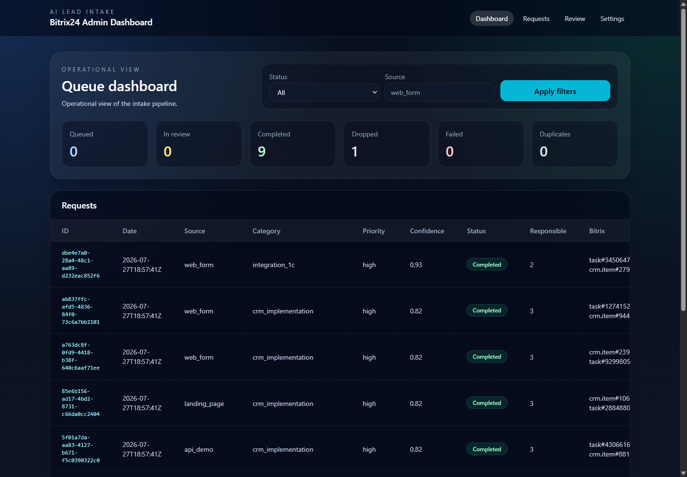
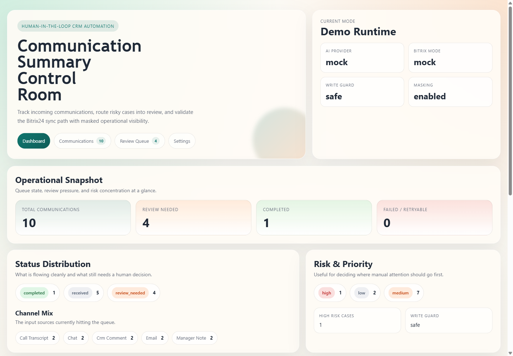
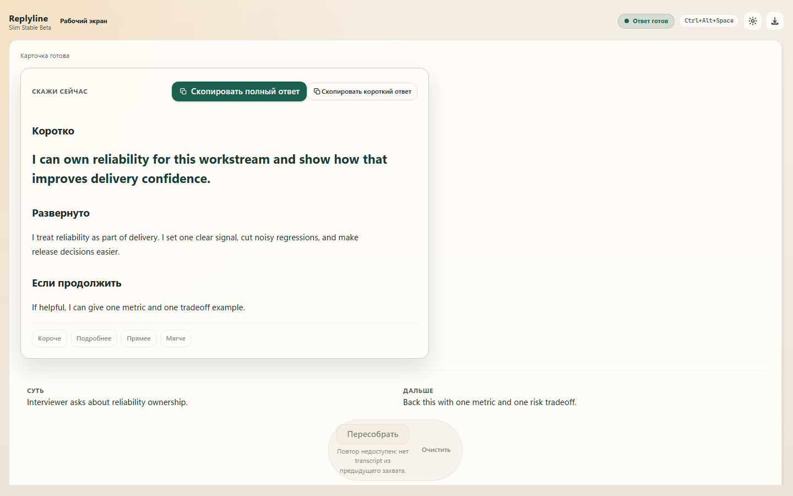

# Часть 3. Прошлые работы

**Время на подготовку части:** 1 час 45 минут.

Все три проекта я разрабатывал самостоятельно: от постановки задачи и архитектуры
до реализации, тестирования и подготовки демонстрационного сценария. AI-инструменты
использовал как ускоритель разработки, но продуктовые решения, интеграционные
границы и проверка результата оставались на моей стороне.

## 1. AI Lead Intake for Bitrix24

**Ссылки:** [репозиторий](https://github.com/iurii-izman/ai-lead-intake-bitrix24) ·
[сценарий демонстрации](https://github.com/iurii-izman/ai-lead-intake-bitrix24/blob/main/docs/demo_walkthrough.md)

**Что это и какую задачу решает.** Сервис принимает входящие лиды из форм и
других источников, маскирует чувствительные данные, классифицирует обращение с
помощью ИИ, применяет прозрачные правила маршрутизации и синхронизирует результат
с Bitrix24. Неоднозначные случаи не отправляются дальше автоматически, а попадают
в очередь ручной проверки.

**Моя роль.** Самостоятельно описал бизнес-процесс и состояния заявки,
спроектировал границы AI- и CRM-интеграций, реализовал защищённый API, фоновую
обработку, административную очередь, тесты и документацию. Отдельно проверил
создание лидов и задач на реальном тестовом портале Bitrix24.

**Технически.** Python 3.12, FastAPI, Pydantic, SQLAlchemy, SQLite,
Docker Compose, Bitrix24 REST API, mock/OpenAI-compatible AI provider,
GitHub Actions и CodeQL.

**Что можно проверить.** Репозиторий содержит воспроизводимый demo walkthrough
и зелёные CI-проверки. Основной путь запускается локально без реальных ключей и
клиентских данных.

## 2. Bitrix24 Communication Summary Agent

**Ссылки:** [репозиторий](https://github.com/iurii-izman/bitrix24-communication-summary-agent) ·
[релиз v0.1.0](https://github.com/iurii-izman/bitrix24-communication-summary-agent/releases/tag/v0.1.0)

**Что это и какую задачу решает.** AI-агент превращает звонки, письма, чаты и
заметки менеджеров в структурированные CRM-действия: краткое резюме,
договорённости, риски, недостающие данные, следующие шаги, follow-up задачи и
черновик ответа. Уверенные результаты проходят дальше автоматически, а спорные
попадают в очередь сотрудника.

**Моя роль.** Самостоятельно спроектировал pipeline обработки коммуникаций,
структуру AI-ответа и human-in-the-loop сценарий. Реализовал FastAPI-сервис,
очередь, административный интерфейс, mock/live адаптер Bitrix24, защиту от
случайной записи и воспроизводимые runbooks. На тестовом портале проверил
создание задач и комментариев в timeline CRM.

**Технически.** Python 3.12, FastAPI, Pydantic, SQLAlchemy, SQLite,
Bitrix24 REST API, mock/OpenAI provider boundary, Docker Compose и GitHub Actions.

**Что можно проверить.** Есть публичный релиз, зелёный CI и локальный
демонстрационный режим на синтетических данных. Реальные записи в Bitrix24
защищены отдельным флагом, а чувствительные поля маскируются.

## 3. Replyline

**Ссылки:** [демо-страница](https://iurii-izman.github.io/replyline/) ·
[репозиторий](https://github.com/iurii-izman/replyline) ·
[beta-релиз](https://github.com/iurii-izman/replyline/releases/tag/v0.2.0-beta.3) ·
[последняя проверка CI](https://github.com/iurii-izman/replyline/actions/runs/30296945914)

**Что это и какую задачу решает.** Windows-приложение для сложных рабочих
разговоров: по горячей клавише захватывает короткий фрагмент системного аудио,
преобразует речь в текст и возвращает не длинную расшифровку, а одну короткую
карточку с рекомендуемым следующим ответом или действием.

**Моя роль.** Сформулировал продуктовый сценарий, разработал архитектуру
desktop-приложения, Rust-backend и интерфейс, подключил STT и LLM, реализовал
локальное хранение настроек, безопасную работу с ключами, автоматические проверки
и release-процесс.

**Технически.** Tauri 2, Rust, WASAPI loopback, SolidJS, TypeScript,
Deepgram STT, OpenAI-compatible LLM API и Windows Credential Manager.

**Что можно проверить.** Есть публичная продуктовая страница, исходный код,
beta-релизы и автоматизированные Rust/TypeScript тесты. Ключи хранятся в
Windows Credential Manager, приложение не ведёт фоновую запись и не сохраняет
историю расшифровок.

